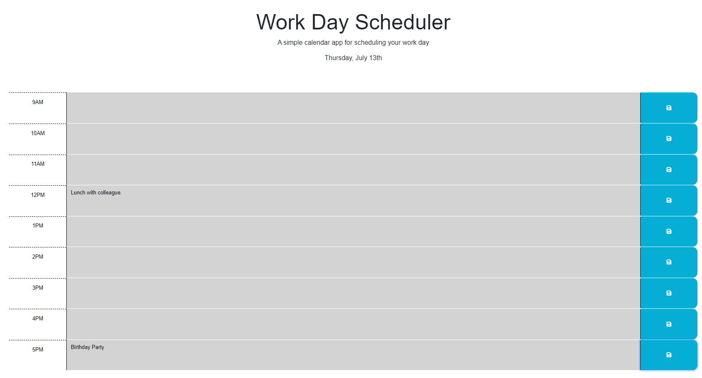

# Work Day Scheduler Starter Code

## Description
This website was created by Florian Kreuk as part of the UCONN Coding Bootcamp module 5. The purpose of this website is to generate a calendar that stores events when saved. During the work day, the hourly calendar slots will change colors to reflect the past, present, and future.

The following image demonstrates the web application's appearence:

The following link takes you to the deployed application: [link](https://f-kreuk.github.io/work-day-scheduler/)

## Installation
N/A

## Usage
To use this website, simply input the calendar event and select the blue save button. When you refresh the page, your saved events will remain in local storage.

## Credits
For the css reset, I utilized the sample provided in 28-Stu_Mini-Project through the UCONN coding bootcamp.

I utilized the following resource to get the month from today's date:
https://stackoverflow.com/questions/1643320/get-month-name-from-date

## License
Please refer to the LICENSE in repo.